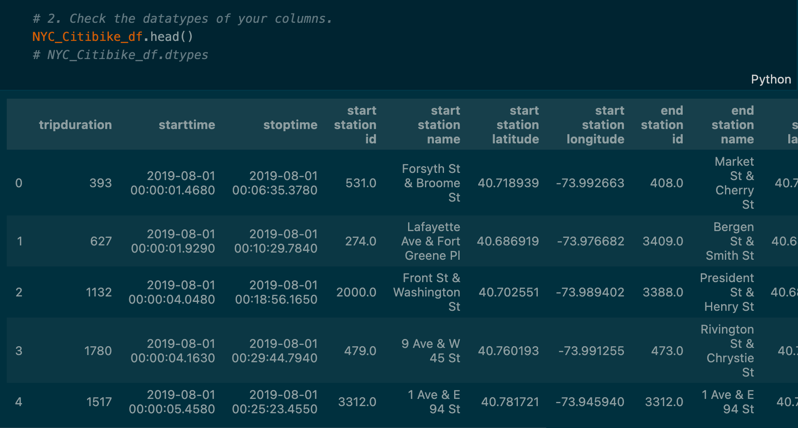
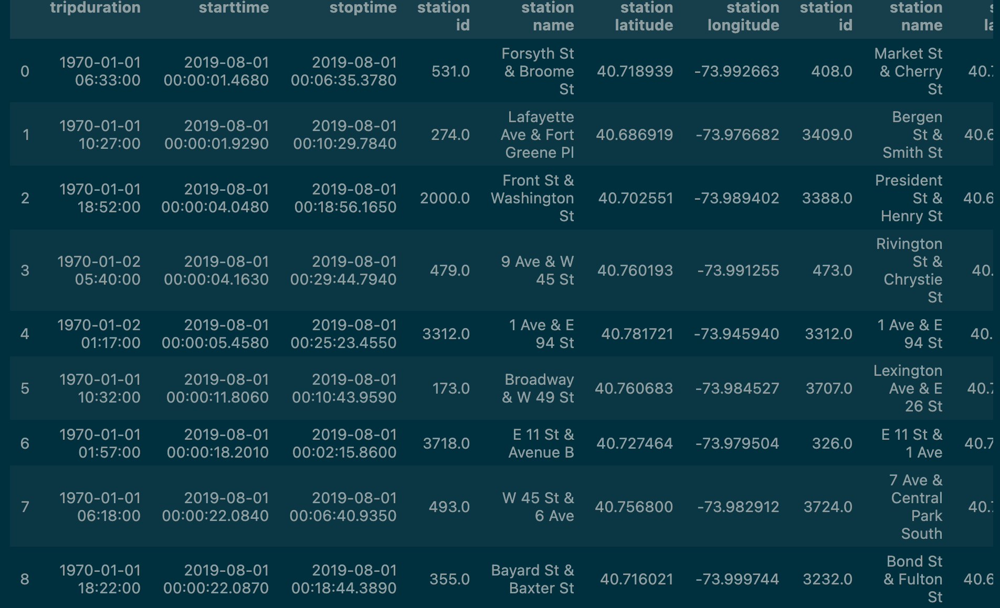
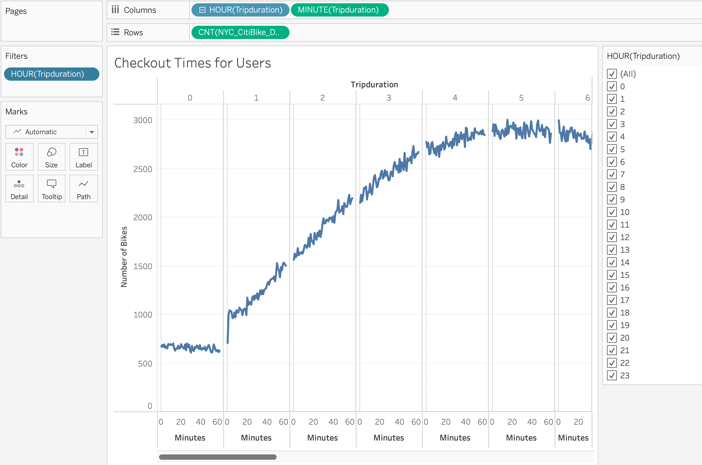
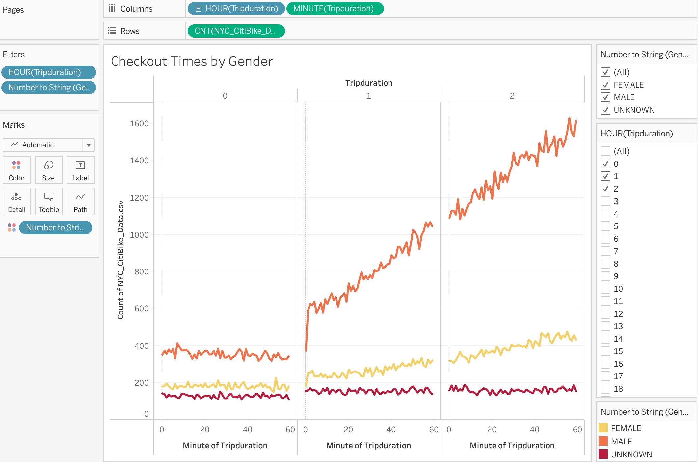

# Bikesharing in NYC
## Purpose of Analysis
The first part of preparing of this analysis was using Pandas to convert the tripduration from an integer to datetime. After this conversion, we used Tableau to create different visualizations to convince investors that a bike-sharing program is Des Moines is a feasible and profitable proposal. Using the converted tripduration, we were assigned to create a set of visualizations:
- Show the length of time that bikes are checked out for all riders and genders
- Show the number of bike trips for all riders and genders for each hour of each day of the week
- Show the number of bike trips for each type of user and gender for each day of the week

### Conversion Comparison
Before:

After:

## Results
- This picture depicts length of time bikes were checked out for all riders and genders:

- This picture depicts a breakdown of length of time bikes were checked out filtered by gender. Males, represented by the orange line, use bikes 3-4 times more than females (yellow) and 9-10 times more than the other/unknown categorization (red):

