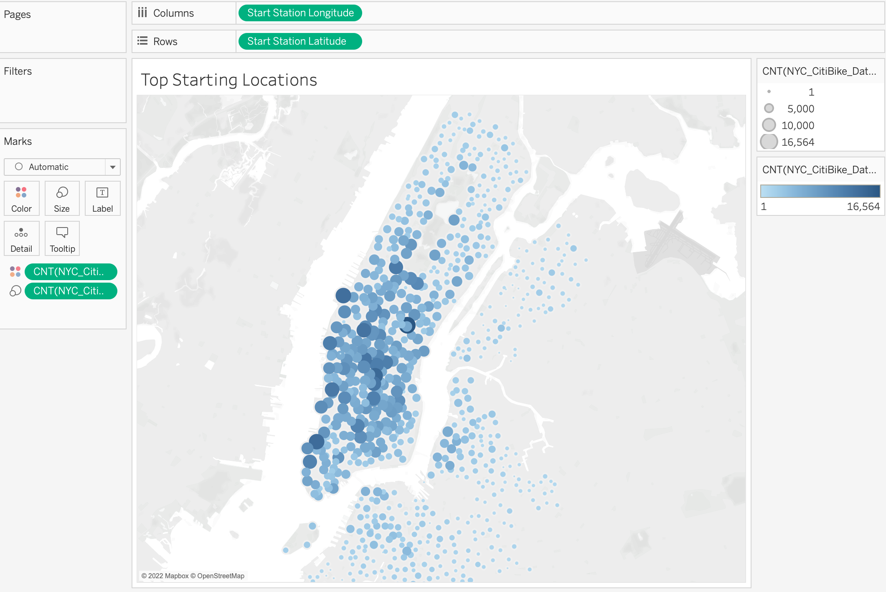

# Bikesharing in NYC
## Purpose of Analysis
The first part of preparing of this analysis was using Pandas to convert the tripduration from an integer to datetime. After this conversion, we used Tableau to create different visualizations to convince investors that a bike-sharing program is Des Moines is a feasible and profitable proposal. Using the converted tripduration, we were assigned to create a set of visualizations:
- Show the length of time that bikes are checked out for all riders and genders
- Show the number of bike trips for all riders and genders for each hour of each day of the week
- Show the number of bike trips for each type of user and gender for each day of the week

### Conversion Comparison
Before:

After:

## Results
- This picture depicts length of time bikes were checked out for all riders and genders:

- This picture depicts a breakdown of length of time bikes were checked out filtered by gender. Males, represented by the orange line, use bikes 3-4 times more than females (yellow) and 9-10 times more than the other/unknown categorization (red):

- This picture depicts a heatmap of bike utilization by weekday and by hour, filtered by gender. For the female and male categories, there is a trend in bikes being used more during the hours of 6AM to 10AM and then again between 5PM and 8PM. In the unknown category, there does not seem to be enough data to see a trend:

- This picture depicts another heatmap of a breakdown of customer vs subscriber, filtered by gender. In the subscriber usertype, males use bikes more overall, but in the female and male categories, bike use is heavier between the days of Thursday and Saturday. Mostly subscribers use the bikes versus possible one-time use customers:

- This picture depicts another heatmap of bike utilization by weekday and by hour. Overall observations are that during early work hours, or early rushhour, bike utilization increases; between the hours 6AM and 9AM. Bike utilization remains steady until 5PM at which point it increases; notable difference between the hours of 5PM and 7PM:

## Overall Summary
Overall, it seems having a bike-sharing program would benefit Des Moines, especially if people become subscribers to the program rather than just being one-time customers. Especially, since the population gender ratio in Des Moines is approximately 50:50, a bike-sharing program would become popular in the area. It would also become a bigger hit during the summer months, since it seems temperature averages in NYC compared to Des Moines seem to be similar with a high 84 degrees Fahrenheit, low of 69 degrees Fahrenheit (NYC), and a high of 84 degrees Fahrenheit, low of 64 degrees Fahrenheit (Des Moines). It might be increasingly more popular in Des Moines during summer since there is a slight degree difference in the lows. Maybe one way to entice the female and other/unknown categories is to create more advertising/marketing methods targeted towards them.

### Additional Visualizations
- This picture depicts top starting locations for bikes. In comparison to upper Manhattan and the surrounding areas, downtown Manhattan shows more utilization. Possibly, more people are traveling from the inner city to other areas:

- This last picture shows August peak hour. Between the hours of 6AM and 9AM, bike utilization increases. It increases again between the hours of 4PM and 7PM. This trend is possibly due to the weather changes throughout the day:

